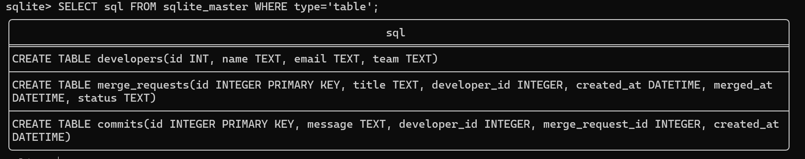

Drizzle ORM kullanarak SQL

Kodu calisitrmak icin sirasiyla asagidaki adimlari takip edebilirsiniz:
`npm install` kodunu dosya konumunda calistirin,
`.env` dosyasi olusturun, icerigi `.env.example` dosyasindaki kaliba uygun olmalidir,
`npx drizzle-kit push`,
`npx tsx index.ts` komutlarini da calistirdiginizda olacaktir.

Gun 8'de sqlite3 uzerinden elle yazdıgım CREATE TABLE'lar:

Text format:
CREATE TABLE developers(
    id INT, 
    name TEXT, 
    email TEXT, 
    team TEXT)

CREATE TABLE merge_requests(
    id INTEGER PRIMARY KEY, 
    title TEXT, 
    developer_id INTEGER, 
    created_at DATETIME, 
    merged_at DATETIME, 
    status TEXT)

CREATE TABLE commits(
    id INTEGER PRIMARY KEY,
    message TEXT, 
    developer_id INTEGER, 
    merge_request_id INTEGER, 
    created_at DATETIME)

*
*
*
*

Drizzle ORM kullanarak uretilen:
CREATE TABLE `commits` (
	`id` integer PRIMARY KEY AUTOINCREMENT,
	`message` text NOT NULL,
	`developer_id` integer NOT NULL,
	`merge_request_id` integer NOT NULL,
	`created_at` text NOT NULL,
	CONSTRAINT `fk_commits_developer_id_developers_id_fk` FOREIGN KEY (`developer_id`) REFERENCES `developers`(`id`),
	CONSTRAINT `fk_commits_merge_request_id_merge_requests_id_fk` FOREIGN KEY (`merge_request_id`) REFERENCES `merge_requests`(`id`)
);
--> statement-breakpoint
CREATE TABLE `developers` (
	`id` integer PRIMARY KEY AUTOINCREMENT,
	`name` text NOT NULL,
	`email` text NOT NULL UNIQUE,
	`team` text NOT NULL
);
--> statement-breakpoint
CREATE TABLE `merge_requests` (
	`id` integer PRIMARY KEY AUTOINCREMENT,
	`title` text NOT NULL,
	`developer_id` integer NOT NULL,
	`created_at` text NOT NULL,
	`merged_at` text,
	`status` text NOT NULL,
	CONSTRAINT `fk_merge_requests_developer.id_developers_id_fk` FOREIGN KEY (`developer.id`) REFERENCES `developers`(`id`)
);

*
*
*
*

ORM ve El Yazımı SQL Farklari:

    Gun 8'de "created_at", "merged_at" yazildigi zaman DATETIME kullanmıstım,
    ORM ile yazarken DATE ve/veya DATETIME bulunmadigi icin TEXT olarak olusturdum.

    Gun 8'de yazdigim koda kiyasla ORM ile yazılan surekli olarak backtick (``) ile cevirilmis,
    SQL'in reserve kelimelerinin karismamasi icin bu yontemi uyguluyor.